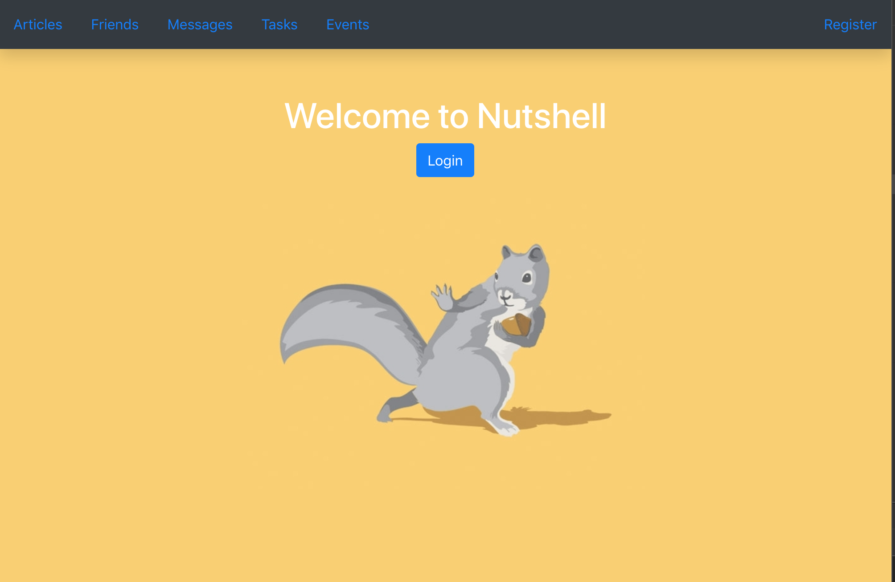

# Reactive Nutshell: The Information Dashboard

## Download Instructions
1. Click the green "Clone or download" button located at the top right of this repository.
1. Copy the link located below Clone with SSH. You will paste this link in the next step.
1. Run the command `git clone <paste_link_here>`.
1. `cd` into the directory it creates.
1. In the api directory, create a copy of the `database.json.example` and remove the `.example` extension.
1. Run `npm install` and wait for all dependencies to be installed.
1. Run `json-server -p 5002 -w database.json` in a different window or tab of your terminal.
1. Run `npm start` to verify that installation was successful and start the application.

## Team
* Events & Friends: Caroline Brownlee
* Articles: Julian Garcia
* Tasks: Bito Mann
* Messages: Sam Pita

## What is Reactive Nutshell?

Nutshell is a new app for people to use to organize their daily tasks, events, news article, friends, and chat messages.

This application is built using the React library and JSON Server.