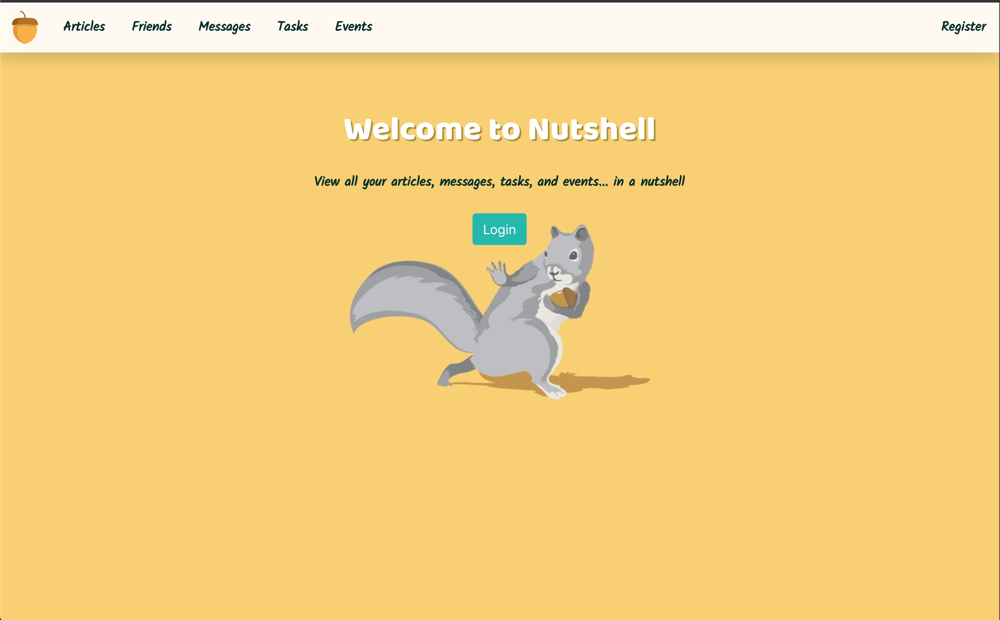

# Reactive Nutshell: The Information Dashboard

## Download Instructions
1. Click the green "Clone or download" button located at the top right of this repository.
1. Copy the link located below Clone with SSH. You will paste this link in the next step.
1. Run the command `git clone <paste_link_here>`.
1. `cd` into the directory it creates.
1. In the api directory, create a copy of the `database.json.example` and remove the `.example` extension.
1. Run `npm install` and wait for all dependencies to be installed.
1. Run `json-server -p 5002 -w database.json` in a different window or tab of your terminal.
1. Run `npm start` to verify that installation was successful and start the application.

## Team
* Events & Friends: Caroline Brownlee
* Articles: Julian Garcia
* Tasks: Bito Mann
* Messages & App Styling: Sam Pita

## What is Reactive Nutshell?

Nutshell is a new app for people to use to organize their daily tasks, events, news article, friends, and chat messages. As seen below, a user can log in with their unique credentials and view their own collection of saved articles (with hyperlinks to the articles' original pages), a list of their friends...

... as well as view everyone's messages on the message board (a user can edit and delete ONLY his or her own messages), a list of tasks to complete, and events to attend.

This application is built using the React library and JSON Server.